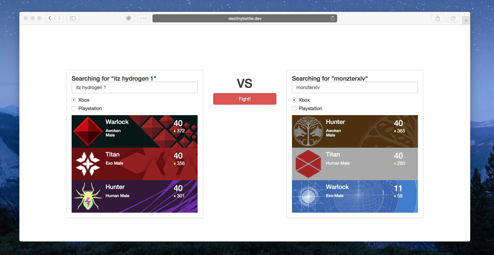

# Destiny Battle
Laravel + VueJS + Destiny API

## Install
- `git clone git@github.com:gjrdiesel/destinybattle.git`
- `cd` into destinybattle
- `composer install`
- `npm install`
- Copy the .env.example to .env
- Setup a `bungie API` env key in the `.env` file